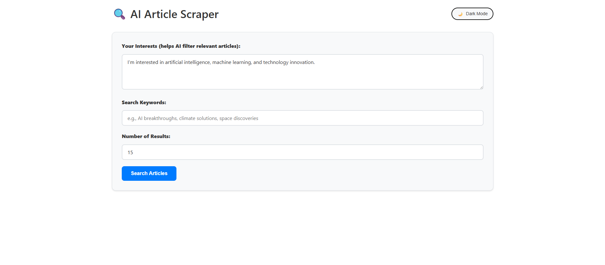

# AI Article Scraper

An intelligent article discovery tool that searches multiple news sources and uses AI to filter articles based on your interests.



## Features

- **Multi-Source Search**: Searches Hacker News, Reddit, arXiv, BBC, TechCrunch, The Verge, and other RSS feeds simultaneously
- **AI-Powered Filtering**: Uses Claude AI to intelligently filter articles based on your specified interests
- **Smart Content Extraction**: Scrapes and previews article content automatically
- **Modern Web Interface**: Clean, responsive design with dark/light mode toggle
- **Robust Error Handling**: Graceful fallbacks and detailed logging
- **Concurrent Processing**: Fast parallel searching across all sources

## Tech Stack

- **Backend**: Python, Flask, asyncio, aiohttp
- **AI**: Anthropic Claude API
- **Scraping**: BeautifulSoup, feedparser
- **Frontend**: Vanilla HTML/CSS/JavaScript with modern design
- **Data Processing**: RSS feed parsing, JSON APIs, XML parsing

## Quick Start

### Prerequisites

- Python 3.8+
- Anthropic API key ([Get one here](https://console.anthropic.com/))

### Installation

1. **Clone the repository**
```bash
git clone https://github.com/ikenna-e/ai-article-scraper.git
cd ai-article-scraper
```

2. **Create virtual environment**
```bash
python -m venv venv

# On Windows:
venv\Scripts\activate

# On Mac/Linux:
source venv/bin/activate
```

```markdown
3. **Install dependencies**
```bash
pip install -r requirements.txt

**Note**: Ensure you use these specific versions for compatibility:
```
aiohttp==3.8.6
anthropic==0.25.1
beautifulsoup4==4.12.2
Flask==2.3.3
flask-cors==4.0.0
lxml==4.9.3
python-dotenv==1.0.0
feedparser==6.0.10
httpx==0.27.0  # Critical: newer versions cause API issues
```
```

4. **Set up environment variables**
```bash
# Create .env file
echo "ANTHROPIC_API_KEY=your-api-key-here" > .env
```

5. **Run the application**
```bash
python app.py
```

6. **Open your browser**
Navigate to `http://localhost:5000`

## Usage

1. **Describe your interests** in the text area (e.g., "I'm interested in AI, climate tech, space exploration")

2. **Enter search keywords** (e.g., "artificial intelligence breakthrough")

3. **Set number of results** (5-50 articles)

4. **Click "Search Articles"** and wait for AI-filtered results

The system will:
- Search 8+ different sources simultaneously
- Find relevant articles based on your keywords
- Use Claude AI to filter articles matching your interests
- Scrape article content for previews
- Present personalized, relevant results

## Configuration

### Adding News Sources

Edit `article_scraper.py` to add more RSS feeds:

```python
'newsapi_sources': [
    'https://your-rss-feed.com/feed.xml',
    # Add more feeds here
]
```

### Customizing AI Filtering

Modify the filtering prompt in the `filter_relevant_articles` method to adjust how Claude evaluates article relevance.

## API Endpoints

- `GET /` - Web interface
- `POST /api/search` - Search articles
  ```json
  {
    "keywords": "search terms",
    "interests": "your interests description", 
    "num_results": 15
  }
  ```

## Deployment

### Option 1: Railway (Recommended)

1. Push code to GitHub
2. Connect repository at [railway.app](https://railway.app)
3. Add environment variable: `ANTHROPIC_API_KEY`
4. Deploy automatically

### Option 2: Heroku

```bash
# Create Procfile
echo "web: python app.py" > Procfile

# Deploy
heroku create your-app-name
heroku config:set ANTHROPIC_API_KEY=your-key-here
git push heroku main
```

### Option 3: Docker

```bash
docker build -t ai-article-scraper .
docker run -p 5000:5000 -e ANTHROPIC_API_KEY=your-key ai-article-scraper
```

## Project Structure

```
ai-article-scraper/
├── app.py                 # Flask web application
├── article_scraper.py     # Core scraping and AI logic
├── requirements.txt       # Python dependencies
├── .env                   # Environment variables (not in repo)
├── .gitignore            # Git ignore patterns
├── Procfile              # Heroku deployment config
├── Dockerfile            # Docker configuration
└── README.md             # Project documentation
```

## Troubleshooting

### Common Issues

**API Key Error**: Ensure your `ANTHROPIC_API_KEY` is correctly set in `.env`

**Model Not Found**: The project uses Claude 3 Haiku. If you get 404 errors, your API key may not have access to Claude models.

**RSS Feed Failures**: Some feeds may be temporarily unavailable. The system continues with available sources.

**Proxy Issues**: If behind corporate firewall, you may need to configure proxy settings.

### Debug Mode

Run with detailed logging:
```bash
python app.py
```
Check terminal output for detailed search and filtering logs.

## Contributing

1. Fork the repository
2. Create a feature branch (`git checkout -b feature/amazing-feature`)
3. Commit changes (`git commit -m 'Add amazing feature'`)
4. Push to branch (`git push origin feature/amazing-feature`)
5. Open a Pull Request

### Development Setup

```bash
# Install development dependencies
pip install -r requirements.txt

# Run tests
python -m pytest tests/

# Format code
black *.py
```

## Roadmap

- [ ] Add email notifications for new articles
- [ ] Implement user accounts and saved searches
- [ ] Add sentiment analysis
- [ ] Support for more languages
- [ ] Mobile app
- [ ] RSS feed output
- [ ] Advanced filtering options
- [ ] Article summarization

## License

This project is licensed under the MIT License - see the [LICENSE](LICENSE) file for details.

## Support

If you find this project useful, please consider:
- Starring the repository
- Reporting issues
- Contributing improvements

## Acknowledgments

- [Anthropic](https://www.anthropic.com/) for Claude AI API
- [Hacker News RSS](https://hnrss.org/) for search capabilities
- All the news sources providing RSS feeds

---

**Note**: This tool is for personal and educational use. Please respect the terms of service of news sources and rate limits.